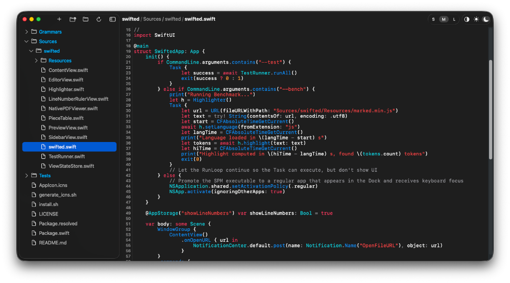

# SwiftEd

SwiftEd is a native macOS text and code editor built with **Swift** and **SwiftUI**. It uses modern macOS text APIs and efficient data structures to support viewing and editing large files.



This is an AI-generated project, developed collaboratively using [Antigravity](https://antigravity.google/) from Google. It is a minimal editor designed to launch rapidly and provide a lightweight way to browse source files. It is not intended to be a full-fledged IDE or compete with heavier, more feature-rich developer tools.

## Key Features

*   **Native UI**: Built with SwiftUI, supporting macOS Light and Dark modes.
*   **Text Rendering**: Uses **TextKit 2** (`NSTextContentStorage`, `NSTextLayoutManager`) for asynchronous, lazy layout.
*   **Piece Table Data Structure**: Uses a Piece Table implementation for the text buffer to efficiently handle insertions and deletions.
*   **Syntax Highlighting**: Parses syntax using **TreeSitter** via `SwiftTreeSitter`. Highlighting is performed asynchronously.
*   **In-Document Search**: Integrated text search (`Cmd + F`) with match highlighting, next/previous navigation, match counts, and case sensitivity toggling.
*   **Custom Line Numbers**: Uses a custom `LineNumberGutterView` that hooks into TextKit 2 layout fragments.
*   **Semantic Zooming**: Per-document magnification and scroll position tracking via `ViewStateStore`.
*   **Live Preview**: Integrated HTML and Markdown rendering via `WKWebView`.

## Architecture & Components

*   **`EditorView`**: The primary code editor view bridging `NSTextView` with `PieceTableTextStorage` and TextKit 2.
*   **`PieceTable` & `PieceTableTextStorage`**: The underlying data structure for text buffer operations.
*   **`Highlighter`**: Coordinates language grammars and updates token ranges.
*   **`SidebarView`**: The file explorer panel.
*   **`TestRunner`**: A built-in test suite for validating core components from the command line.

## Getting Started

### Downloads

Pre-built, ready-to-run macOS `.app` bundles are automatically compiled and published for every release. You can download the latest version directly from the [GitHub Releases](https://github.com/glaforge/swifted/releases) page.

### Cloning & Submodules

To clone the repository along with all submodules:
```bash
git clone --recursive <repository-url>
```

If you have already cloned the repository, populate the submodules by running:
```bash
git submodule update --init --recursive
```

After checking out the submodules, you need to generate the Tree-sitter parser source code (e.g. for Groovy) before compiling:
```bash
cd Grammars/tree-sitter-groovy
npm install --ignore-scripts
npx -p tree-sitter-cli tree-sitter generate
cd ../..
```

### Compiling
```bash
swift build
```

### Running Locally
To launch the editor and open a specific folder:
```bash
killall swifted && swift run swifted <folder_to_open>
```

### Installing as a macOS App
To compile the release build locally, generate a `.app` bundle, and install it into your `/Applications` directory, simply run the included install script:
```bash
./install.sh
```
Once installed, you can launch **Swifted** directly from Spotlight or Launchpad like any standard macOS app!

## Keyboard Shortcuts

**File Management**
*   `Cmd + O`: Open File/Folder
*   `Cmd + N`: New File
*   `Cmd + Shift + N`: New Scratch File
*   `Cmd + Option + N`: New Folder
*   `Return`: Rename (when selected in sidebar)
*   `Cmd + Delete`: Delete

**Search & Navigation**
*   `Cmd + F`: Find in Document
*   `Cmd + G` or `Return` (in search bar): Next Match
*   `Cmd + Shift + G` or `Shift + Return` (in search bar): Previous Match
*   `Option + C`: Toggle Case Sensitivity
*   `Escape`: Dismiss Find Bar

**View & Layout**
*   `Cmd + B`: Toggle Sidebar
*   `Cmd + Shift + V`: Toggle Live Preview (Markdown/HTML)
*   `Cmd + Option + L`: Toggle Line Numbers

**Zooming**
*   `Cmd + +` or `Cmd + =`: Zoom In
*   `Cmd + -`: Zoom Out
*   `Cmd + 0`: Reset Zoom

## Acknowledgments

This project relies on several fantastic open-source projects:
*   [SwiftTreeSitter](https://github.com/ChimeHQ/SwiftTreeSitter): Swift bindings for the Tree-sitter parsing system by ChimeHQ.
*   [TreeSitterLanguages](https://github.com/simonbs/TreeSitterLanguages): A collection of pre-compiled Tree-sitter grammars by simonbs.
*   [Tree-sitter](https://tree-sitter.github.io/tree-sitter/): The core incremental parsing system.

## License

SwiftEd is open source and available under the [Apache License 2.0](LICENSE).

## Disclaimer

This is not an official Google product.
